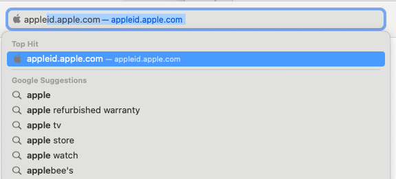
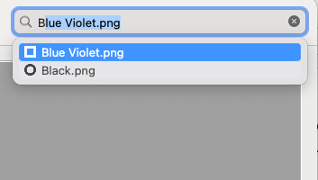

# CustomMenus

Many apps with search functionality have suggestion menus, letting an app provide specific suggestions as the user starts typing into a search field.

AppKit does not have a standard control to provide such a menu. An app could popup an `NSMenu`, but there appears to be no way to let the search field get keystrokes while the menu is being presented. When such an `NSMenu` is visible, typing characters into the search stops working.

This repository tries to provide sample code for providing such a suggestions menu.

## The App

This app looks for image files in `/System/Library/Desktop Pictures`. Start entering the name of an image file, and the app will suggest a set of appropriate images. Select one of the suggestions and the app will display that image.

## How it works

The suggestion menu is contained in a transparent borderless child window. The child window controller takes care of mouse events and gets relevant keyboard information from the search field cell.

## History

Apple published [CustomMenus sample code](https://developer.apple.com/library/archive/samplecode/CustomMenus/Introduction/Intro.html) in 2012 to provide functionality like this. 

In 2018 [Doug Stein](https://github.com/dougzilla32) ported that sample code from Objective-C to Swift using Swiftify, and added a variety of fixes. The result of that work is [available on GitHub](https://github.com/dougzilla32/CustomMenus).

When I needed to implement a suggestion menu in 2023, this code made that feasible. However some functionality did not work as well on Sonoma as it undoubtedly did in 2012 and 2018. So I put some effort into modernizing the codebase and focusing it on a suggestions menu.

## Notes

* The sample app is not sandboxed because it needs access to `/System/Library/Desktop Pictures`.
* `SUGSuggestionGenerator.swift` contains the code that determines the list of suggestions.
* This supports light mode and dark mode.
* This sample app shows and updates the suggestion window immediately after a key is pressed in the search field. In my own app I wait a short amount of time (0.2 milliseconds for now) to let the user continue typing if they have not paused. The benefits of waiting are that the menu is not just flashing while the user is typing, and that the processor is not wasting cycles updating menu contents. The downside is it makes the suggestion menu appear slow to update.
* VoiceOver works, although there is [one issue](https://github.com/jbrayton/CustomMenus/issues/1) for which I have not found a solution. Suggestions welcome.
* Pull requests are welcome.

## Thank you

I could not have done this work myself. Thank you to:

* Apple for the original [CustomMenus sample code](https://developer.apple.com/library/archive/samplecode/CustomMenus/Introduction/Intro.html) sample code.
* Doug Stein for [his work to modernize this code in 2018](https://github.com/dougzilla32/CustomMenus).
* _Lots_ of individuals who helped me. I want to seek their permission before naming them here. I will do that before telling anyone of this repository.